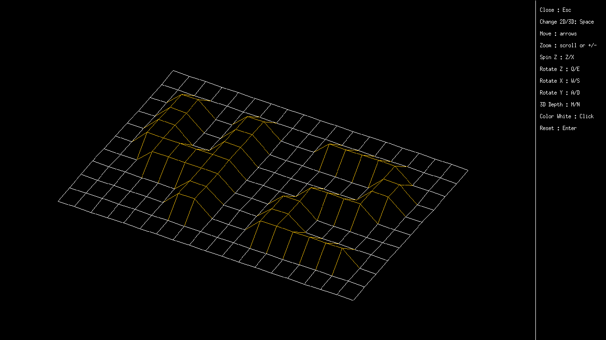

# Fdf 42 Project

## What is it?

This project is about representing a landscape as a 3D object
in which all surfaces are outlined in lines.
It's my first graphical project in C and i had to use the school graphical library: the MiniLibX. This library was developed internally and includes basic necessary tools to open a window, create images and deal with keyboard and mouse events.

<br>

### A few rules

<p>As most of 42's Projects, this one also have a few rules (such as the prohibition of the use of 
<span style="color:#33DAFF">for</span>,
<span style="color:#33DAFF"> VLA</span>,
<span style="color:#33DAFF"> global variables</span>
and others).</p> 

<br>

## Requirements for Linux

(from https://github.com/42Paris/minilibx-linux)
<ul>
	<li>
	MinilibX only support TrueColor visual type (8,15,16,24 or 32 bits depth)</li>
	<li>gcc</li>
	<li>make</li>
	<li>X11 include files (package xorg)</li>
	<li>XShm extension must be present (package libxext-dev)</li>
	<li>Utility functions from BSD systems - development files (package libbsd-dev)</li>
</ul>

## How to use it

```Bash
sudo apt-get install gcc make xorg libxext-dev libbsd-dev

git clone git@github.com:rodrigo-br/fdf_42.git

cd fdf_42/

make

ls maps/

(choose a map)

./fdf maps/(map).fdf
```

